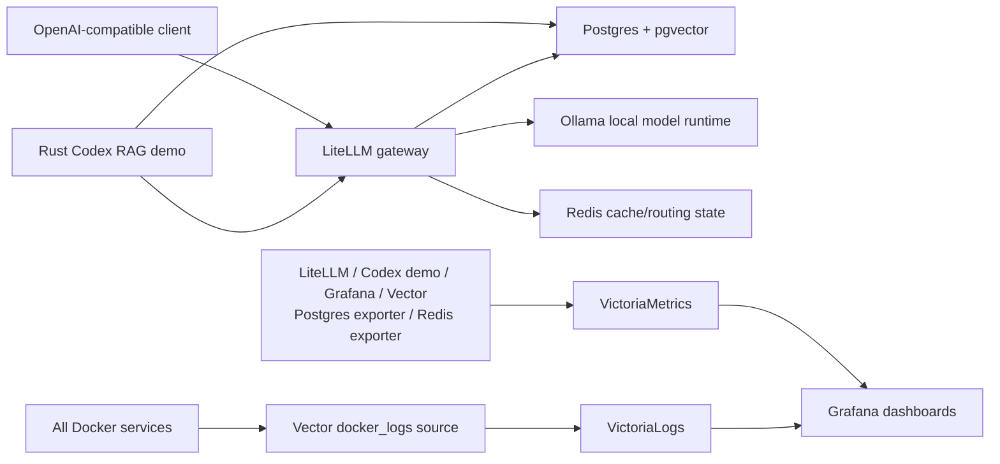

# Docker Compose Stack

This repository is a lecture-ready local AI engineering stack. It is intentionally small enough to run on a laptop, but it demonstrates the same building blocks used in production systems.

## Architecture



## Services

| Service | Port | Purpose |
| --- | ---: | --- |
| Grafana | 3000 | Dashboards for metrics and logs |
| VictoriaMetrics | 8428 | Prometheus-compatible metrics storage and scraping |
| VictoriaLogs | 9428 | Central log storage queried with LogsQL |
| Vector | 8686, 9598 | Docker log collector and its Prometheus metrics |
| LiteLLM | 4000 | OpenAI-compatible LLM gateway |
| Codex RAG Demo | 8080 | Rust RAG service used as the Codex lecture target |
| Ollama | 11434 | Local model hosting |
| Postgres + pgvector | 5432 | LiteLLM state plus demo vector table |
| Redis | 6379 | LiteLLM cache/routing state |
| Postgres exporter | 9187 | Postgres metrics for VictoriaMetrics |
| Redis exporter | 9121 | Redis metrics for VictoriaMetrics |

## Quick Start

```bash
make init
make pull
make doctor
make up
make ps
make urls
```

`make up` starts the full Compose stack, removes orphan containers, waits until healthchecks are ready, and prints the local resource map. `make urls` reprints the same resource map later. `make down` stops the full stack without deleting volumes.

Open:

- Grafana: <http://localhost:3000> (`admin` / `admin` by default)
- LiteLLM UI: <http://localhost:4000/ui>
- Codex RAG Demo: <http://localhost:8080>
- Ollama API: <http://localhost:11434/api/tags>

Run checks:

```bash
make smoke
```

Run a short lecture demo request:

```bash
make demo
```

Generate traffic for dashboards:

```bash
make load
```

Run the pgvector RAG demo:

```bash
make rag
```

Run the Rust Codex RAG demo service:

```bash
make codex-demo
```

Stop without deleting data:

```bash
make down
```

Reset all local volumes:

```bash
make clean
```

## Demo Credentials

This is a local lecture demo. Username/password credentials are intentionally simple and committed to the repository:

| Service | Username | Password |
| --- | --- | --- |
| Grafana | `admin` | `admin` |
| LiteLLM UI | `admin` | `admin` |
| Postgres | `admin` | `admin` |
| Redis | - | `admin` |

LiteLLM API calls use the committed demo bearer token `sk-ai-demo-local-change-me`.

## LiteLLM and Ollama

The default model is `qwen2.5:0.5b` so the first lecture run does not require a large download. Change both values in `.env` if the lecture needs a different model:

```env
OLLAMA_MODEL=qwen2.5:0.5b
LITELLM_OLLAMA_MODEL=ollama_chat/qwen2.5:0.5b
```

The public model name exposed by LiteLLM is `local-chat`.

## Rust Codex RAG Demo Service

The `codex-rag-demo` service is a small Rust/Axum application in `apps/codex-rag-demo/`.

It exposes:

- `GET /health` - checks Postgres and LiteLLM reachability.
- `GET /sources` - lists rows from `demo_knowledge_chunks`.
- `POST /ask` - retrieves pgvector context, calls LiteLLM `local-chat`, and returns answer, sources, and timings.
- `GET /metrics` - exposes Prometheus metrics scraped by VictoriaMetrics.

The service writes structured JSON logs to stdout. Vector collects those Docker logs, normalizes Compose labels into `project`, `service`, `container`, `component`, and `stream`, and sends them to VictoriaLogs.

Example request:

```bash
curl -s http://localhost:8080/ask \
  -H "Content-Type: application/json" \
  -d '{
    "question": "How does Codex use this repository during a lecture?"
  }' | jq
```

## Observability

Metrics flow:

1. VictoriaMetrics scrapes `infra/victoriametrics/promscrape.yml`.
2. The scrape config includes LiteLLM, the Rust Codex RAG demo service, Grafana, Vector, Postgres exporter, Redis exporter, VictoriaMetrics, and VictoriaLogs.
3. Grafana reads VictoriaMetrics as a Prometheus datasource.
4. The provisioned dashboard is available in the `AI Engineering Demo` folder.

Logs flow:

1. Vector reads Docker logs through `/var/run/docker.sock`.
2. Vector normalizes Compose labels into `project`, `service`, `container`, `component`, and `stream`.
3. Vector sends NDJSON to VictoriaLogs `/insert/jsonline`.
4. Grafana reads VictoriaLogs with the `victoriametrics-logs-datasource` plugin.

Useful LogsQL queries in Grafana Explore:

```text
project:="ai-engineering-demo"
project:="ai-engineering-demo" service:=litellm
project:="ai-engineering-demo" error
project:="ai-engineering-demo" | stats by (service) count()
```

## Security Notes

The committed `admin` / `admin` credentials and demo token are for a local lecture demo only. Before exposing anything beyond localhost:

- Replace all passwords and `LITELLM_MASTER_KEY`.
- Keep `LITELLM_SALT_KEY` stable after adding encrypted LiteLLM credentials.
- Do not publish Ollama or LiteLLM directly to the internet.
- Put authentication and TLS in front of Grafana and LiteLLM.
- Pin image digests for repeatable production environments.
- Review Docker socket access for Vector; it is convenient locally but privileged.
